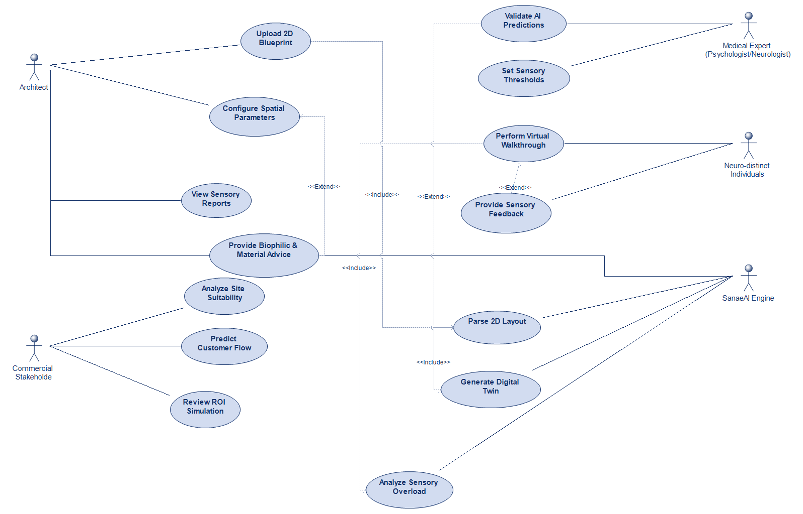
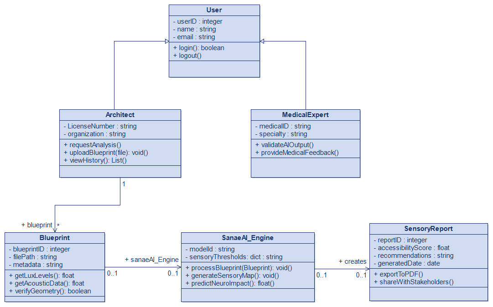
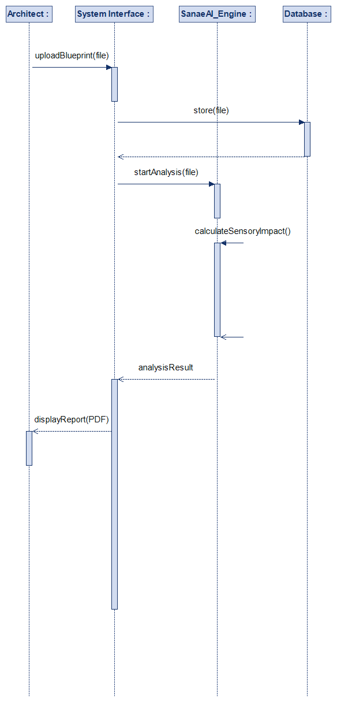
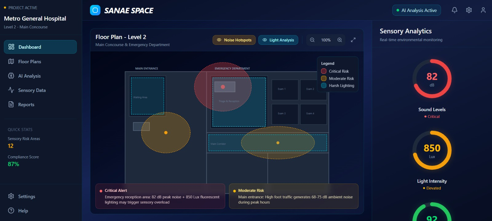
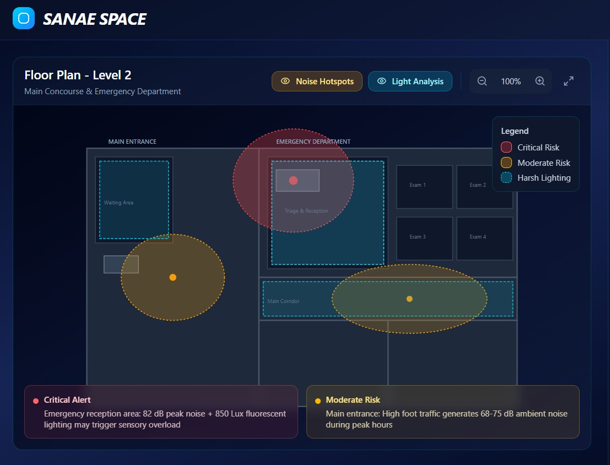
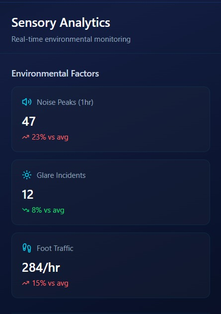
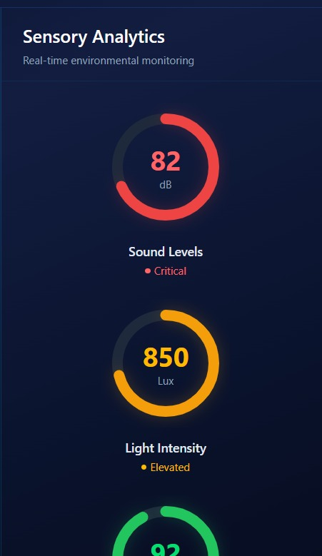

# SanaeSpace: Predictive AI for Neuro-Inclusive Architecture 🏗️🧠

**SanaeSpace** is a predictive AI platform designed to bridge the gap between static blueprints and the lived human experience. Our mission is to ensure that no building is constructed without first understanding its neurological and sensory impact on every citizen.

---

## 🌟 The Vision: Accessibility as DNA
Beyond traditional building codes, **SanaeSpace** pioneers **Sensory Engineering**. We move beyond ramps and elevators to address the "invisible" barriers—the neuro-sensory environment—making inclusivity the very DNA of the building.

## 🛠️ Core Pillars
### 1. Strategic Infrastructure (Digital Twin)
Simulating human flows in high-traffic spaces to prevent financial and environmental waste.
### 2. Engineering for Wellbeing (Sensory Mapping)
Calculating how light lux levels, acoustics, and spatial density affect the human nervous system (Neuro-Distinct Simulations).
### 3. Sanae Academy (Social Impact)
Gamified workshops for youth to design "Inclusive Neighborhoods" using AI.

---

## 📂 Project Structure (Technical Documentation)
This repository is organized to demonstrate the interdisciplinary engineering behind the platform:

* **`docs/`**: Includes **System Architecture**, **Class Diagrams**, and **Sequence Diagrams** (UML).
* **`src/`**: Core Python logic for image processing, AI integration, and sensory calculation.
* **`assets/`**: UI/UX Human-Centric designs (Figma) and 3D simulation demos.
* **`data/`**: Sample 2D blueprints and sensory data parameters.
* **`academy/`**: Educational materials and workshop modules for Sanae Academy.

## 📐 System Architecture Overview
*To visualize the synergy between the AI engine and our stakeholders, here is the official **Use Case Diagram** for SanaaSpace:

**Architect's Note:** This architecture is designed to simplify complex decision-making. By automating sensory analysis, the system allows designers to focus on creativity while ensuring the space is functional and accessible for everyone from day one, significantly reducing the need for costly future adjustments.

*To visualize the data hierarchy and the logic of our AI processing, here is the official Class Diagram for SanaaSpace:

**Architect's Note:** This diagram defines the modular relationship between User Roles, the SanaeAI Engine, and the resulting Sensory Reports. By utilizing inheritance and specialized data dictionaries, we ensure that every blueprint is analyzed with neuro-inclusive precision.

*The following Sequence Diagram details the lifecycle of a blueprint analysis within the SanaaSpace ecosystem, showcasing the interaction between the architect and the backend components:

**Architect's Note:** The sequence emphasizes data integrity and processing depth. Once a blueprint is securely stored in the Database, the SanaeAI Engine performs a series of self-reflexive sensory calculations. This ensures that the final report provided to the architect is not just data, but a validated neuro-inclusive design guide.

## 🚀 Product Showcase: Metro General Hospital Case Study
*SanaeSpace isn't just for residential use; it is engineered for complex public infrastructures.* 

From Logic to Layout, while the backend handles the heavy sensory calculations, the dashboard translates that raw data into an intuitive architectural experience.

This showcase demonstrates a comprehensive Sensory Audit performed on a large-scale hospital facility. The process begins with **Spatial Sensory Intelligence**, where our AI scans the floor plan to identify 'Critical Risk' zones (red) and 'Moderate Risk' zones (amber) based on acoustic resonance and light intensity. This provides a visual roadmap for architects to prioritize immediate interventions.

 
 
 
To support these visuals, the system maintains **Real-time Environmental Monitoring**. This section quantifies environmental factors into measurable metrics—tracking decibel peaks, lux levels, and foot traffic—to calculate a 'Compliance Score' that ensures the space remains within neuro-inclusive comfort thresholds.

  
  

 
Finally, moving beyond detection, SanaeSpace acts as an automated consultant by providing **Actionable Architectural Insights**. Instead of just flagging problems, the AI-driven engine generates specific recommendations—such as acoustic buffering or lighting dimmability—to effectively mitigate sensory triggers and guarantee a truly accessible environment for all.
 

### Key Insights Generated:
* **Acoustic Treatment:** Identified 82dB peaks in Emergency areas.
* **Lighting Adjustment:** Detected harsh 850 Lux zones.
* **Tactile Safety:** Verified 92% flooring compliance for accessibility.

---

## 💻 Technical Ecosystem
* **Predictive AI:** Generative models for 2D to 3D transformation.
* **Sensory Engineering:** Algorithms for noise and light lux level analysis.
* **Tech Stack:** Python, OpenCV, Digital Twin Simulations, Figma.

---

## 🌐 Future Roadmap: Interdisciplinary Synergy
Refining predictive models by collaborating with AI Specialists, Neuroscience Scholars, and Structural Engineers.

*Developed by Malak Louardi — Aspiring Software Engineer committed to social impact.*
