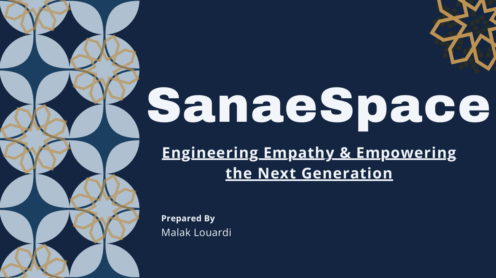
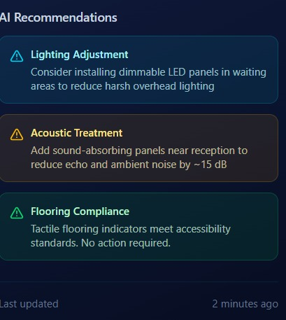
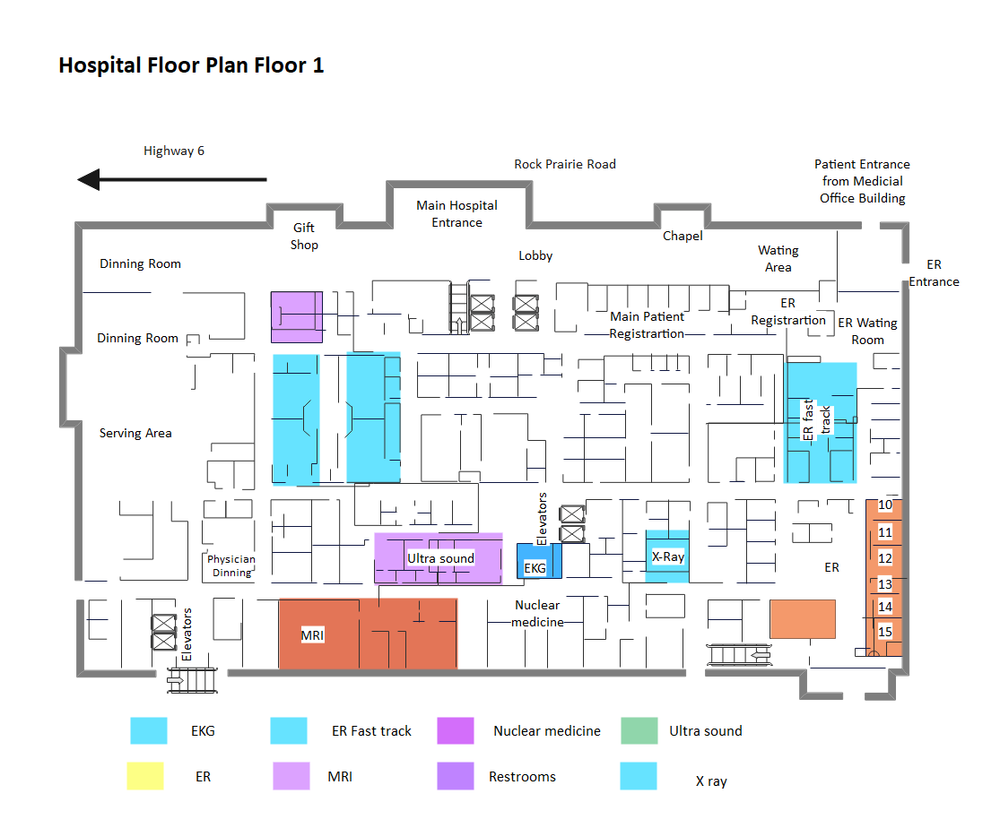
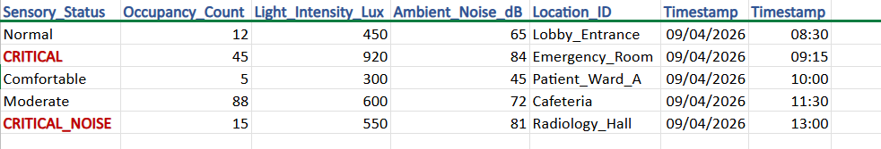

# SanaeSpace: Predictive AI for Neuro-Inclusive Architecture 🏗️🧠

**SanaeSpace** is a predictive AI platform designed to bridge the gap between static blueprints and the lived human experience. my mission is to ensure that no building is constructed without first understanding its neurological and sensory impact on every citizen.

---

## 🌟 The Vision: Accessibility as DNA
Beyond traditional building codes, **SanaeSpace** pioneers **Sensory Engineering**. I move beyond ramps and elevators to address the "invisible" barriers—the neuro-sensory environment—making inclusivity the very DNA of the building.

## 🛠️ Core Pillars
### 1. Strategic Infrastructure (Digital Twin)
Simulating human flows in high-traffic spaces to prevent financial and environmental waste.
### 2. Engineering for Wellbeing (Sensory Mapping)
Calculating how light lux levels, acoustics, and spatial density affect the human nervous system (Neuro-Distinct Simulations).
### 3. Sanae Academy (Social Impact)
Gamified workshops for youth to design "Inclusive Neighborhoods" using AI.

---
## ✨ The Vision: Where it all started
*SanaeSpace isn't just a technical tool; it's a mission to redefine how we perceive architectural inclusivity.*

 >*"Accessibility is not a feature; it is the DNA of the building."*
 

  

**[👉 View Interactive the Full Concept Presentation](./SanaeSpace_Vision.pdf)**

This presentation outlines the core philosophy of SanaeSpace, tracing its journey from a visionary concept to a data-driven platform, and now, the foundation of **Sanae Academy**.

---
## 📂 Project Structure (Technical Documentation)
This repository is organized to demonstrate the interdisciplinary engineering behind the platform:

* **`docs/`**: Includes **System Architecture**, **Class Diagrams**, and **Sequence Diagrams** (UML).
* **`src/`**: Core Python logic for image processing, AI integration, and sensory calculation.
* **`assets/`**: UI/UX Human-Centric designs (Figma) and 3D simulation demos.
* **`data/`**: Sample 2D blueprints and sensory data parameters.
* **`academy/`**: Educational materials and workshop modules for Sanae Academy.

## 📐 System Architecture Overview
*To visualize the synergy between the AI engine and my stakeholders, here is the official **Use Case Diagram** for SanaaSpace:

**Architect's Note:** This architecture is designed to simplify complex decision-making. By automating sensory analysis, the system allows designers to focus on creativity while ensuring the space is functional and accessible for everyone from day one, significantly reducing the need for costly future adjustments.

*To visualize the data hierarchy and the logic of my AI processing, here is the official Class Diagram for SanaaSpace:

**Architect's Note:** This diagram defines the modular relationship between User Roles, the SanaeAI Engine, and the resulting Sensory Reports. By utilizing inheritance and specialized data dictionaries, I ensure that every blueprint is analyzed with neuro-inclusive precision.

*The following Sequence Diagram details the lifecycle of a blueprint analysis within the SanaaSpace ecosystem, showcasing the interaction between the architect and the backend components:

**Architect's Note:** The sequence emphasizes data integrity and processing depth. Once a blueprint is securely stored in the Database, the SanaeAI Engine performs a series of self-reflexive sensory calculations. This ensures that the final report provided to the architect is not just data, but a validated neuro-inclusive design guide.

## 🚀 Product Showcase: Metro General Hospital Case Study
*SanaeSpace isn't just for residential use; it is engineered for complex public infrastructures.*

This showcase demonstrates a comprehensive Sensory Audit performed on a large-scale hospital facility. The process is broken down into three core phases:

* **Spatial Sensory Intelligence:** My AI scans the architectural floor plan to identify 'Critical Risk' zones (red) and 'Moderate Risk' zones (amber) based on simulated acoustic resonance and light intensity.
* **Real-time Environmental Monitoring:** This section quantifies environmental factors—tracking decibel peaks, lux levels, and foot traffic—to calculate a 'Compliance Score' that ensures the space remains within neuro-inclusive comfort thresholds.
* **Actionable Architectural Insights:** Instead of just flagging problems, the AI-driven engine generates specific recommendations—such as acoustic buffering or lighting dimmability—to effectively mitigate sensory triggers.

---

### 🖼️ Visual Breakdown

  
  

  
  
   

---
### 🔗 Interactive Prototype
To experience the full logic and user flow of the **SanaeSpace Dashboard**, you can explore the interactive prototype on Figma:

[👉 View Interactive Figma Prototype](https://www.figma.com/make/ooaUev31uB47lv0slqsDJf/Dashboard-UI-Kit?t=QyCqsAhmMui7KIne-20&fullscreen=1)

*Note: This is a Functional Walkthrough focusing on the "Happy Path" of a sensory audit. While the UI represents the full architectural vision, interactivity is currently limited to the Hospital Case Study flow (from blueprint upload to AI recommendation report) to demonstrate the core logic integration.*

---

### Key Insights Generated:
* **Acoustic Treatment:** Identified 82dB peaks in Emergency areas.
* **Lighting Adjustment:** Detected harsh 850 Lux zones.
* **Tactile Safety:** Verified 92% flooring compliance for accessibility.

---
## 📊 Data & Methodology: The Technical Backbone
*SanaeSpace transforms raw architectural data into actionable sensory intelligence through three integrated layers:*

**Spatial Raw Data :** I utilize standardized 2D architectural layouts [located here](data/blueprints) as the primary input for my analysis. By processing real-world environments like hospitals and schools, the system identifies how physical structures influence sensory flow.

**The AI Decision Engine [thresholds.json](data/thresholds.json) :** This file represents the "brain" of our system. It defines the scientific boundaries for sensory safety—classifying environmental factors (e.g., Noise levels > 82dB, Light intensity > 850 Lux) as critical risks based on neurodivergence research and architectural standards.

**Sensory Simulation Logs [sensory_logs.png](data/sensory-logs.png) :** To validate my prototypes, we generated structured datasets that mimic real-time sensor feedback. This ensures that every alert and "Red Zone" shown in the dashboard is rooted in consistent, verifiable environmental data.

---

## 🎓 Sanae Academy (Social Impact)
Sanae Academy is the educational extension of this project, designed to empower youth and future architects with sensory-inclusive design principles.

### 📚 Explore the Academy Materials:
* **[Workshop Curriculum](./academy/curriculum.md)**: A 3-module guide covering Empathy in Design, AI integration, and Social Responsibility.
* **[Interactive Sensory Quiz](./academy/quiz.md)**: A gamified assessment to test knowledge on sensory thresholds and inclusive philosophy.

> *"We are not just building tools; we are nurturing the next generation of human-centric innovators designers."*

---
## 💻 Technical Ecosystem
* **Predictive AI:** Generative models for 2D to 3D transformation.
* **Sensory Engineering:** Algorithms for noise and light lux level analysis.
* **Tech Stack:** Python, OpenCV, Digital Twin Simulations, Figma.

---

## 🌐 Future Roadmap: Interdisciplinary Synergy
Refining predictive models by collaborating with AI Specialists, Neuroscience Scholars, and Structural Engineers.

*Developed by Malak Louardi — Aspiring Software Engineer committed to social impact.*
